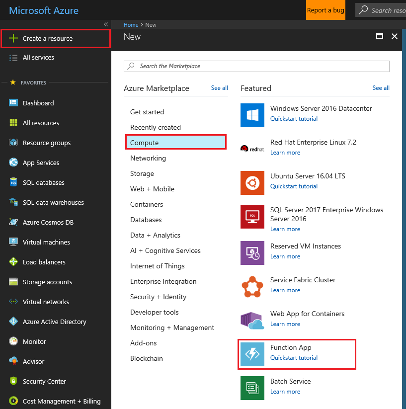

1. Select the **New** button found on the upper left-hand corner of the Azure portal, then select **Compute** > **Function App**. 

    

2. Use the function app settings as specified in the table below the image.

    

    | Setting      | Suggested value  | Description                                        |
    | ------------ |  ------- | -------------------------------------------------- |
    | **App name** | Globally unique name | Name that identifies your new function app. Valid characters are `a-z`, `0-9`, and `-`.  | 
    | **Subscription** | Your subscription | The subscription under which this new function app is created. | 
    | **[Resource Group](../articles/azure-resource-manager/resource-group-overview.md)** |  myResourceGroup | Name for the new resource group in which to create your function app. | 
    | **[Storage](../articles/storage/common/storage-create-storage-account.md#create-a-storage-account)** |  Globally unique name |  Name of the new storage account used by your function app. Storage account names must be between 3 and 24 characters in length and may contain numbers and lowercase letters only. You can also use an existing account. |
    | **App Service plan/Location** | | An App Service plan is the container for your app. The App Service plan settings will determine the location, features, cost and compute resources associated with your app.

3. Select **Create** to provision and deploy the function app. 

4. Select the Notification icon in the upper-right corner of the portal and watch for the **Deployment succeeded** message. 

    

4. Select **Go to resource** to view your new function app.

>[!TIP]
>Having trouble finding your function apps in the portal, try [adding Function Apps to your favorites in the Azure portal](../articles/azure-functions/functions-how-to-use-azure-function-app-settings.md#favorite).   

