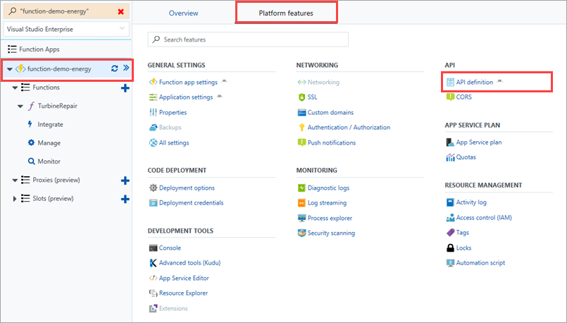

## Export an API definition
You have an OpenAPI definition for your function, from [Create an OpenAPI definition for a function](../articles/azure-functions/functions-openapi-definition.md). The next step in this process is to export the API definition so that PowerApps and Microsoft Flow can use it in a custom API.

> [!IMPORTANT]
> Remember that you must be signed into Azure with the same credentials that you use for your PowerApps and Microsoft Flow tenants. This enables Azure to create the custom API and make it available for both PowerApps and Microsoft Flow.

1. In the [Azure portal](https://portal.azure.cn), click your function app name (like **function-demo-energy**) > **Platform features** > **API definition**.

    

1. Click **Export to PowerApps + Flow**.

    

1. In the right pane, use the settings as specified in the table.

    |Setting|Description|
    |--------|------------|
    |**Export Mode**|Select **Express** to automatically generate the custom API. Selecting **Manual** exports the API definition, but then you must import it into PowerApps and Microsoft Flow manually. For more information, see [Export to PowerApps and Microsoft Flow](../articles/azure-functions/app-service-export-api-to-powerapps-and-flow.md).|
    |**Environment**|Select the environment that the custom API should be saved to. For more information, see [Environments overview (PowerApps)](https://powerapps.microsoft.com/tutorials/environments-overview/) or [Environments overview (Microsoft Flow)](https://us.flow.microsoft.com/documentation/environments-overview-admin/).|
    |**Custom API Name**|Enter a name, like `Turbine Repair`.|
    |**API Key Name**|Enter the name that app and flow builders should see in the custom API UI. Note that the example includes helpful information.|
 
    

1. Click **OK**. The custom API is now built and added to the environment you specified.

