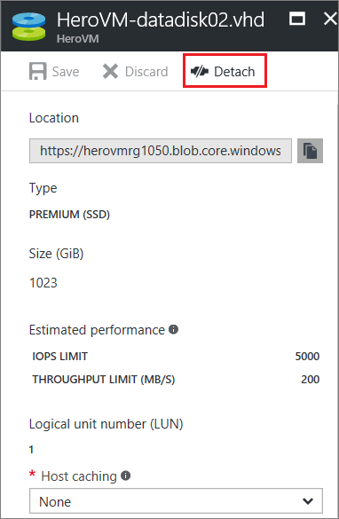

When you no longer need a data disk that's attached to a virtual machine, you can easily detach it. Detaching a disk removes the disk from the virtual machine, but doesn't delete the disk from the Azure storage account.

If you want to use the existing data on the disk again, you can reattach it to the same virtual machine, or another one.  

> [!NOTE]
> To detach an operating system disk, you first need to delete the virtual machine.
>

## Find the disk
If you don't know the name of the disk or want to verify it before you detach it, follow these steps.

1. Sign in to the [Azure portal](https://portal.azure.cn).

2. Click **Virtual Machines**, and then select the appropriate VM.

3. Click **Disks** along the left edge of the virtual machine dashboard, under **Settings**.

 The virtual machine dashboard lists the name and type of all attached disks. For example, this screen shows a virtual machine with one operating system (OS) disk and one data disk:

    

## Detach the disk
1. From the Azure portal, click **Virtual Machines**, and then click the name of the virtual machine that has the data disk you want to detach.

2. Click **Disks** along the left edge of the virtual machine dashboard, under **Settings**.

3. Click the disk you want to detach.

  

4. From the command bar, click **Detach**.

  

5. In the confirmation window, click **Yes** to detach the disk.

  

The disk remains in storage but is no longer attached to a virtual machine.