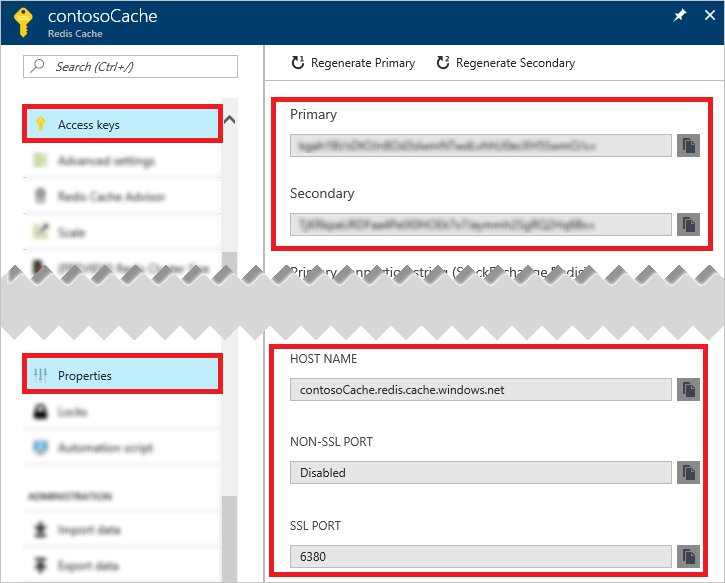

To connect to an Azure Redis Cache instance, cache clients need the host name, ports, and keys of the cache. Some clients may refer to these items by slightly different names. You can retrieve this information in the Azure portal or by using command-line tools such as Azure CLI.

### Retrieve host name, ports, and access keys using the Azure Portal
To retrieve host name, ports, and access keys using the Azure Portal, [browse](../articles/redis-cache/cache-configure.md#configure-redis-cache-settings) to your cache in the [Azure portal](https://portal.azure.cn) and click **Access keys** and **Properties** in the **Resource menu**. 



### Retrieve host name, ports, and access keys using Azure CLI
To retrieve the host name and ports using Azure CLI 2.0 you can call [az redis show](https://docs.microsoft.com/cli/azure/redis#show), and to retrieve the keys you can call [az redis list-keys](https://docs.microsoft.com/cli/azure/redis#list-keys). The following script calls these two commands and echos the hostname, ports, and keys to the console.

```azurecli
#/bin/bash

# Retrieve the hostname, ports, and keys for contosoCache located in contosoGroup

# Retrieve the hostname and ports for an Azure Redis Cache instance
redis=($(az redis show --name contosoCache --resource-group contosoGroup --query [hostName,enableNonSslPort,port,sslPort] --output tsv))

# Retrieve the keys for an Azure Redis Cache instance
keys=($(az redis list-keys --name contosoCache --resource-group contosoGroup --query [primaryKey,secondaryKey] --output tsv))

# Display the retrieved hostname, keys, and ports
echo "Hostname:" ${redis[0]}
echo "Non SSL Port:" ${redis[2]}
echo "Non SSL Port Enabled:" ${redis[1]}
echo "SSL Port:" ${redis[3]}
echo "Primary Key:" ${keys[0]}
echo "Secondary Key:" ${keys[1]}
```

For more information about this script, see [Get the hostname, ports, and keys for Azure Redis Cache](../articles/redis-cache/scripts/cache-keys-ports.md). For more information on Azure CLI 2.0, see [Install Azure CLI 2.0](https://docs.microsoft.com/cli/azure/install-azure-cli) and [Get started with Azure CLI 2.0](https://docs.microsoft.com/cli/azure/get-started-with-azure-cli).
