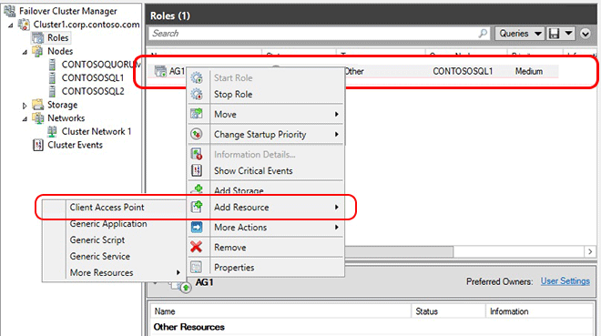

In this step, you manually create the availability group listener in Failover Cluster Manager and SQL Server Management Studio.

1. Open Failover Cluster Manager from the node that hosts the primary replica.

2. Select the **Networks** node, and then note the cluster network name. This name is used in the $ClusterNetworkName variable in the PowerShell script.

3. Expand the cluster name, and then click **Roles**.

4. In the **Roles** pane, right-click the availability group name, and then select **Add Resource** > **Client Access Point**.

    

5. In the **Name** box, create a name for this new listener, click **Next** twice, and then click **Finish**.  
    Do not bring the listener or resource online at this point.

6. Click the **Resources** tab, and then expand the client access point you just created. 
    The IP address resource for each cluster network in your cluster is displayed. If this is an Azure-only solution, only one IP address resource is displayed.

7. Do either of the following:

   * To configure a hybrid solution:

        a. Right-click the IP address resource that corresponds to your on-premises subnet, and then select **Properties**. Note the IP address name and network name.

        b. Select **Static IP Address**, assign an unused IP address, and then click **OK**.

   * To configure an Azure-only solution:

        a. Right-click the IP address resource that corresponds to your Azure subnet, and then select **Properties**.

       > [!NOTE]
       > If the listener later fails to come online because of a conflicting IP address selected by DHCP, you can configure a valid static IP address in this properties window.
       > 
       > 

       b. In the same **IP Address** properties window, change the **IP Address Name**.  
        This name is used in the $IPResourceName variable of the PowerShell script. If your solution spans multiple Azure virtual networks, repeat this step for each IP resource.