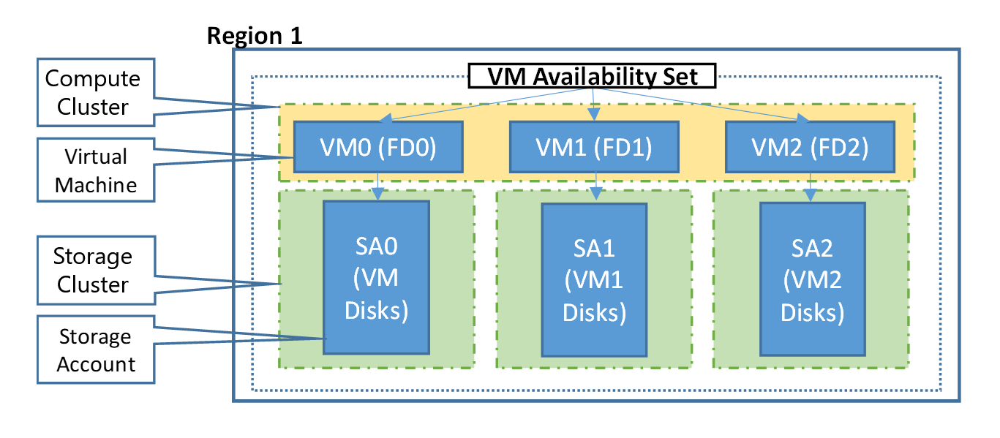

# Regions and availability for virtual machines in Azure
It is important to understand how and where your virtual machines (VMs) operate in Azure, along with your options to maximize performance, availability, and redundancy. Azure operates in 2 datacenters around China. These datacenters are grouped in to geographic regions, giving you flexibility in choosing where to build your applications. This article provides you with an overview of the availability and redundancy features of Azure.

## What are Azure regions?
You create Azure resources in defined geographic regions like 'China North' or 'China East'. There are currently 2 Azure regions in China: China East and China North. Within each region, multiple datacenters exist to provide for redundancy and availability. This approach gives you flexibility as you design applications to create VMs closest to your users and to meet any legal, compliance, or tax purposes.

## Storage availability
Understanding Azure regions and geographies becomes important when you consider the available storage replication options. Depending on the storage type, you have different replication options.

**Azure Managed Disks**
* Locally redundant storage (LRS)
  * Replicates your data three times within the region in which you created your storage account.

**Storage account-based disks**
* Locally redundant storage (LRS)
  * Replicates your data three times within the region in which you created your storage account.
* Zone redundant storage (ZRS)
  * Replicates your data three times across two to three facilities, either within a single region or across two regions.
* Geo-redundant storage (GRS)
  * Replicates your data to a secondary region that is hundreds of miles away from the primary region.
* Read-access geo-redundant storage (RA-GRS)
  * Replicates your data to a secondary region, as with GRS, but also then provides read-only access to the data in the secondary location.

The following table provides a quick overview of the differences between the storage replication types:

| Replication strategy | LRS | ZRS | GRS | RA-GRS |
|:--- |:--- |:--- |:--- |:--- |
| Data is replicated across multiple facilities. |No |Yes |Yes |Yes |
| Data can be read from the secondary location and from the primary location. |No |No |No |Yes |
| Number of copies of data maintained on separate nodes. |3 |3 |6 |6 |

You can read more about [Azure Storage replication options here](../articles/storage/storage-redundancy.md). For more information about managed disks, see [Azure Managed Disks overview](../articles/storage/storage-managed-disks-overview.md).

### Storage costs
Prices vary depending on the storage type and availability that you select.

**Azure Managed Disks**
* Premium Managed Disks are backed by Solid-State Drives (SSDs) and Standard Managed Disks are backed by regular spinning disks. Both Premium and Standard Managed Disks are charged based on the provisioned capacity for the disk.

**Unmanaged disks**
* Premium storage is backed by Solid-State Drives (SSDs) and is charged based on the capacity of the disk.
* Standard storage is backed by regular spinning disks and is charged based on the in-use capacity and desired storage availability.
  * For RA-GRS, there is an additional Geo-Replication Data Transfer charge for the bandwidth of replicating that data to another Azure region.

See [Azure Storage Pricing](https://www.azure.cn/pricing/details/storage/) for pricing information on the different storage types and availability options.

## Availability sets
An availability set is a logical grouping of VMs that allows Azure to understand how your application is built to provide for redundancy and availability. We recommended that two or more VMs are created within an availability set to provide for a highly available application and to meet the [99.95% Azure SLA](https://www.azure.cn/support/sla/virtual-machines/). When a single VM is using [Azure Premium Storage](../articles/storage/storage-premium-storage.md), the Azure SLA applies for unplanned maintenance events. 

An availability set is compromised of two additional groupings that protect against hardware failures and allow updates to safely be applied - fault domains (FDs) and update domains (UDs).

You can read more about how to manage the availability of [Linux VMs](../articles/virtual-machines/linux/manage-availability.md) or [Windows VMs](../articles/virtual-machines/linux/manage-availability.md).

### Fault domains
A fault domain is a logical group of underlying hardware that share a common power source and network switch, similar to a rack within an on-premises datacenter. As you create VMs within an availability set, the Azure platform automatically distributes your VMs across these fault domains. This approach limits the impact of potential physical hardware failures, network outages, or power interruptions.

### Update domains
An update domain is a logical group of underlying hardware that can undergo maintenance or be rebooted at the same time. As you create VMs within an availability set, the Azure platform automatically distributes your VMs across these update domains. This approach ensures that at least one instance of your application always remains running as the Azure platform undergoes periodic maintenance. The order of update domains being rebooted may not proceed sequentially during planned maintenance, but only one update domain is rebooted at a time.

### Managed Disk fault domains
For VMs using [Azure Managed Disks](../articles/storage/storage-faq-for-disks.md), VMs are aligned with managed disk fault domains when using a managed availability set. This alignment ensures that all the managed disks attached to a VM are within the same managed disk fault domain. Only VMs with managed disks can be created in a managed availability set. The number of managed disk fault domains varies by region - either two or three managed disk fault domains per region.

> [!IMPORTANT]
> The number of fault domains for managed availability sets varies by region - either two or three per region. The following table shows the number per region

[!INCLUDE [managed-disks-common-fault-domain-region-list](managed-disks-common-fault-domain-region-list.md)]

## Next steps
You can now start to use these availability and redundancy features to build your Azure environment. For best practices information, see [Azure availability best practices](../articles/best-practices-availability-checklist.md).
