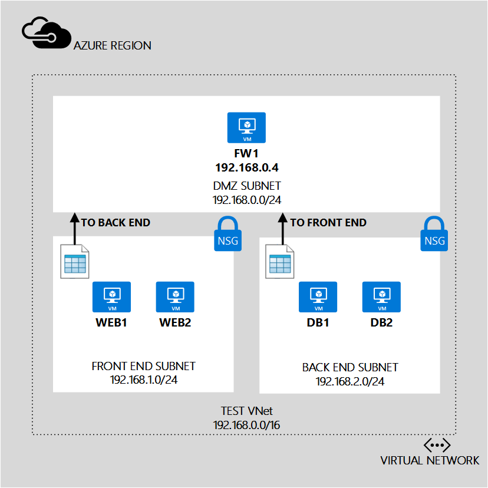

## Scenario
To better illustrate how to create UDRs, this document will use the scenario below.

In this scenario you will create one UDR for the *Front end subnet* and another UDR for the *Back end subnet* , as described below: 

* **UDR-FrontEnd**. The front end UDR will be applied to the *FrontEnd* subnet, and contain one route:    
  * **RouteToBackend**. This route will send all traffic to the back end subnet to the **FW1** virtual machine.
* **UDR-BackEnd**. The back end UDR will be applied to the *BackEnd* subnet, and contain one route:    
  * **RouteToFrontend**. This route will send all traffic to the front end subnet to the **FW1** virtual machine.

The combination of these routes will ensure that all traffic destined from one subnet to another will be routed to the **FW1** virtual machine, which is being used as a virtual appliance. You also need to turn on IP forwarding for that VM, to ensure it can receive traffic destined to other VMs.