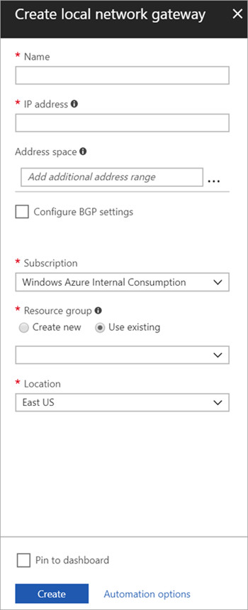

1. In the portal, from **All resources**, click **+Add**.
2. In the **Everything** page search box, type **Local network gateway**, then click to return a list of resources. Click **Local network gateway** to open the page, then click **Create** to open the **Create local network gateway** page.

    
3. On the **Create local network gateway page**, specify the values for your local network gateway.

    - **Name:** Specify a name for your local network gateway object. If possible, use something intuitive, such as **ClassicVNetLocal** or **TestVNet1Local**. This makes it easier for you to identify the local network gateway in the portal.
    - **IP address:** Specify a valid Public **IP address** for the VPN device or virtual network gateway to which you want to connect.

      - **If this local network represents an on-premises location:** Specify the Public IP address of the VPN device that you want to connect to. It cannot be behind NAT and has to be reachable by Azure.
      - **If this local network represents another VNet:** Specify the Public IP address that was assigned to the virtual network gateway for that VNet.
      - **If you don't yet have the IP address:** You can make up a valid placeholder IP address, and then come back and modify this setting before connecting.
    - **Address Space** refers to the address ranges for the network that this local network represents. You can add multiple address space ranges. Make sure that the ranges you specify here do not overlap with ranges of other networks to which you connect.
    - **Configure BGP settings:** Use only when configuring BGP. Otherwise, don't select this.
    - **Subscription:** Verify that the correct subscription is showing.
    - **Resource Group:** Select the resource group that you want to use. You can either create a new resource group, or select one that you have already created.
    - **Location:** Select the location that this object will be created in. You may want to select the same location that your VNet resides in, but you are not required to do so.
4. Click **Create** to create the local network gateway.

<!-- ms.date: 12/12/2017 -->